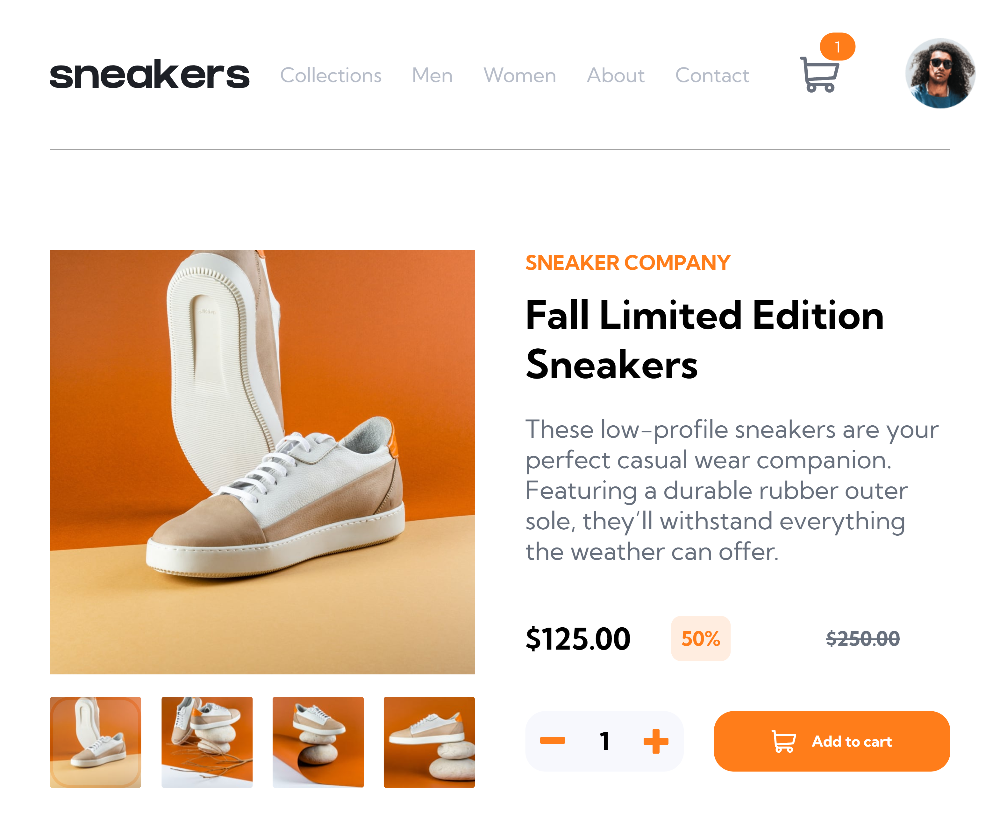

# Frontend Mentor - E-commerce product page solution

This is a solution to the [E-commerce product page challenge on Frontend Mentor](https://www.frontendmentor.io/challenges/ecommerce-product-page-UPsZ9MJp6). Frontend Mentor challenges help you improve your coding skills by building realistic projects.

## Table of contents

- [Overview](#overview)
  - [The challenge](#the-challenge)
  - [Screenshot](#screenshot)
  - [Links](#links)
- [My process](#my-process)
  - [Built with](#built-with)
  - [What I learned](#what-i-learned)
  - [Continued development](#continued-development)
- [Author](#author)

## Overview

### The challenge

Users should be able to:

- View the optimal layout depending on their device's screen size
- See hover states for interactive elements

### Screenshot

### Links

- Solution URL: [Add solution URL here](https://github.com/d4wk0m/Ecommerce-Product-Page)
- Live Site URL: [Add live site URL here](https://d4wk0m.github.io/Ecommerce-Product-Page/)

## My process

### Built with

- Semantic HTML5 markup
- CSS custom properties
- Flexbox

### What I learned

I've learned a lot of JS.

### Continued development

I will be focusing on using more flexbox and building more responsive websites

## Author

- Website - [Dawid Komęza](http://dkomeza.great-site.net)
- Frontend Mentor - [@d4wk0m](https://www.frontendmentor.io/profile/d4wk0m)